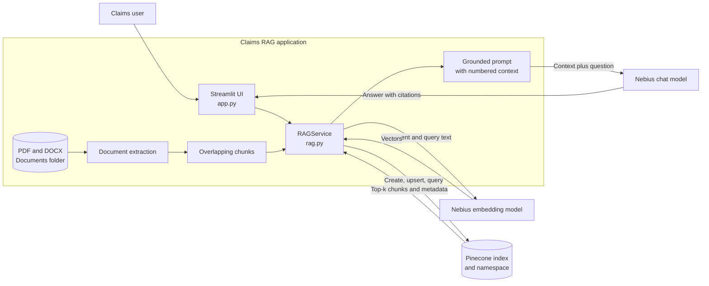
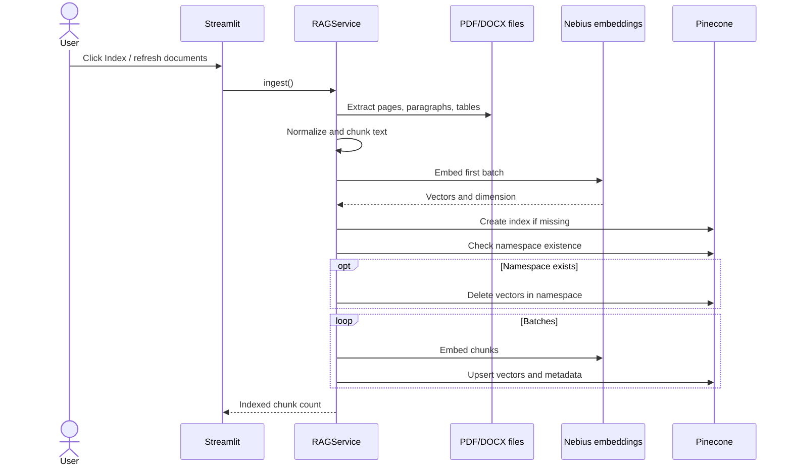
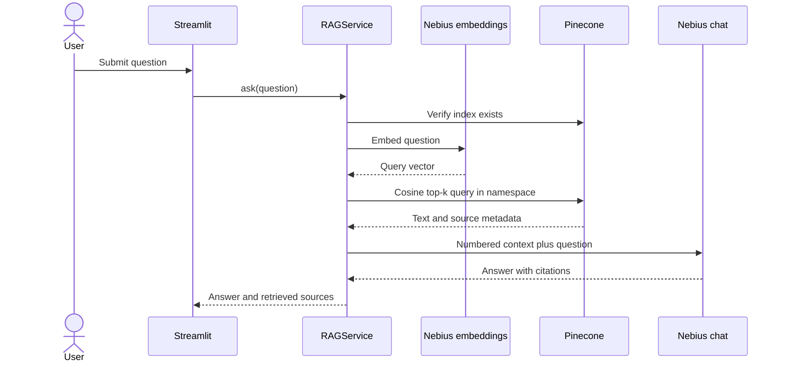

# Architecture

## Component diagram

## Ingestion flow

## Question-answering flow

## Vector metadata

| Field | Description |
|---|---|
| `source` | Original filename |
| `page` | PDF page or DOCX section marker |
| `chunk` | Chunk number within the page/section |
| `text` | Source text supplied to the chat model |

Vector IDs are deterministic SHA-256-derived identifiers based on filename, page, chunk number, and text.

## Design decisions

- The OpenAI-compatible client supports both Nebius chat and embeddings.
- The first embedding response determines the Pinecone index dimension.
- Refresh deletes only the configured namespace, never the entire index.
- Missing namespaces are not deleted, preventing first-run 404 errors.
- Low-temperature generation reduces variability for claim answers.
- The system prompt requires context-only answers and inline citations.

## Current limitations

- No OCR for scanned PDFs
- Character-based rather than token-based chunks
- No authentication or per-user authorization
- No conversational history
- Generated citation markers should be checked against the retrieved-source panel
- Full chunk text is stored as Pinecone metadata; production use requires a privacy and retention review

